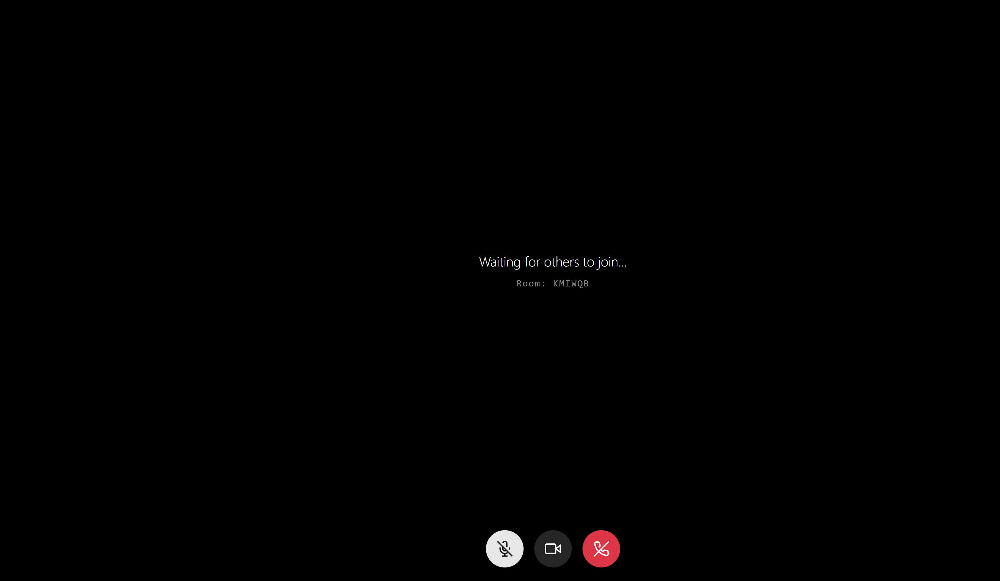
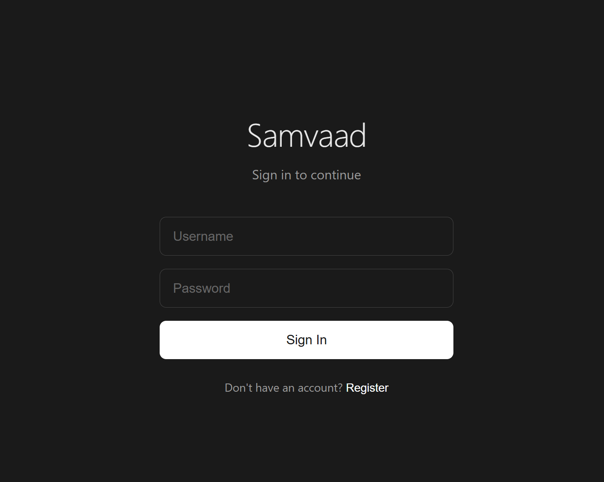
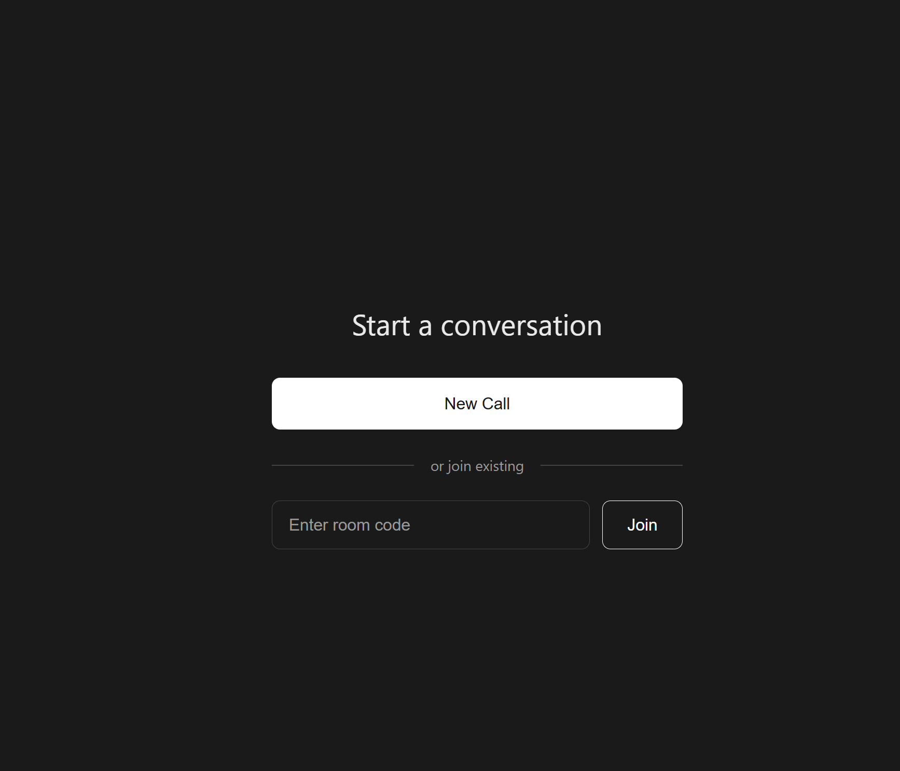

# Samvaad

**Simple, private, self-hosted video calling.**

Samvaad (Sanskrit for "dialogue" or "conversation") is an open-source, peer-to-peer video conferencing platform. Host your own video calls without relying on third-party services.



## Features

- **Peer-to-Peer Video Calls** - WebRTC-based direct video/audio means your conversations stay between you and your caller
- **Simple Room Codes** - Create or join calls with short, shareable 6-character codes
- **Secure Authentication** - JWT-based user registration and login
- **Media Controls** - Mute/unmute microphone, enable/disable camera during calls
- **Cross-Device Support** - Works on desktop and mobile browsers
- **Self-Hostable** - Deploy your own instance with full control over your data
- **Privacy First** - No tracking, no analytics, no data collection

## Screenshots

<table>
  <tr>
    <td></td>
    <td></td>
  </tr>
  <tr>
    <td align="center"><em>Sign in or create an account</em></td>
    <td align="center"><em>Start a new call or join with a code</em></td>
  </tr>
</table>

## Quick Start

### Prerequisites

- Go 1.24+
- Node.js 18+
- npm

### 1. Start the Backend

```bash
cd backend/cmd/server
go run main.go
```

The signaling server starts on `http://localhost:8080`

### 2. Start the Frontend

```bash
cd frontend
npm install
npm run dev
```

The app is now available at `http://localhost:3000`

### 3. Start Calling

1. Open `http://localhost:3000` in your browser
2. Register an account
3. Click **New Call** to generate a room code
4. Share the code with someone else
5. They join using the same code

## Testing Across Devices

To test between your computer and phone, use ngrok:

```bash
ngrok http 3000
```

Open the ngrok HTTPS URL on your phone. HTTPS is required for camera access on mobile devices.

## Tech Stack

| Component | Technology |
|-----------|------------|
| Frontend | React 19, TypeScript, Vite |
| Backend | Go 1.24, Gorilla WebSocket |
| Real-time | WebSocket signaling server |
| Video | WebRTC (peer-to-peer) |
| Auth | JWT tokens |

## Project Structure

```
samvaad/
├── backend/
│   ├── cmd/server/        # HTTP server, WebSocket upgrade
│   └── internal/
│       ├── auth/          # JWT authentication
│       ├── logger/        # Structured logging
│       └── signaling/     # WebSocket hub & client management
├── frontend/
│   └── src/
│       ├── components/    # React components
│       ├── context/       # Auth context
│       ├── pages/         # Login, Home, Call pages
│       └── services/      # WebSocket, WebRTC, Auth services
└── docs/                  # Documentation & assets
```

## How It Works

1. **Authentication** - Users register/login via REST API, receiving a JWT token
2. **Signaling** - WebSocket connection (authenticated) handles room join/leave and WebRTC signaling
3. **Media** - WebRTC establishes direct peer-to-peer video/audio streams
4. **No Media Server** - Video/audio flows directly between browsers, not through our servers

## Current Limitations

- Maximum 2 users per room (1-on-1 calls only)
- In-memory storage (no persistence across restarts)
- STUN only (no TURN server for restrictive NATs)

## Roadmap

- [ ] Group calls (3+ participants)
- [ ] Screen sharing
- [ ] Chat during calls
- [ ] Persistent user accounts (database)
- [ ] TURN server integration
- [ ] Recording

## Contributing

Contributions are welcome! Please feel free to submit issues and pull requests.

## License

MIT License - see [LICENSE](LICENSE) for details.

---

**Samvaad** - Your conversations, your server, your control.
