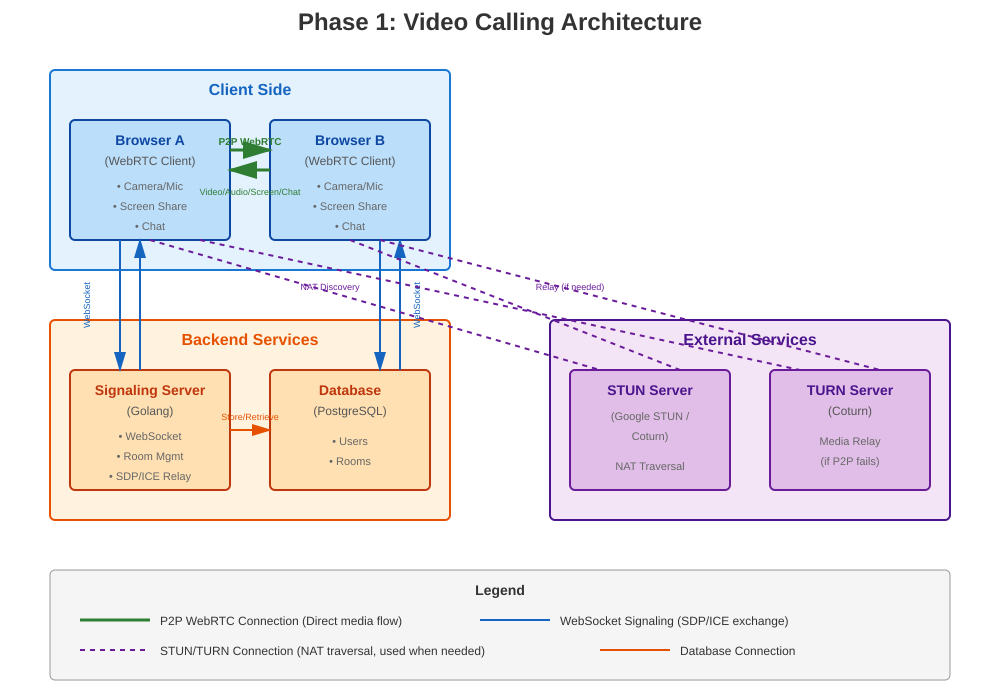
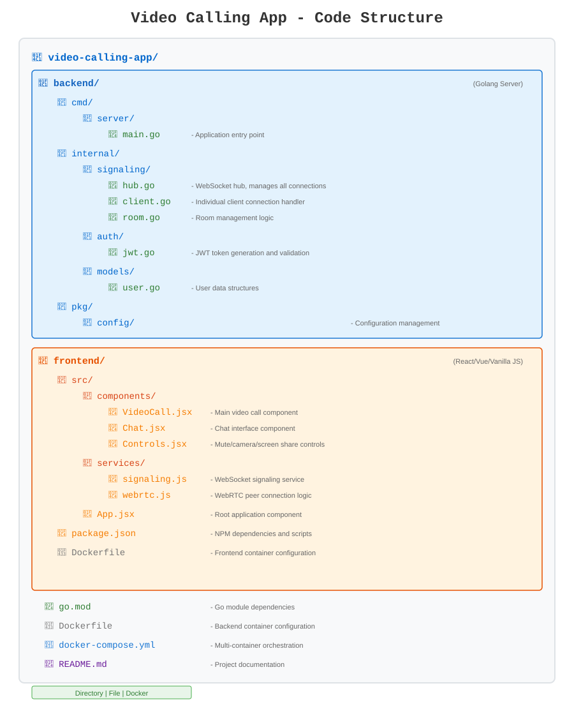

# Problem Statement
Develop a browser based video conferencing application that can be used to make video, voice calls for peer to peer to connection or group connectivity.

This document 

## Phase 1

We will be using WebRTC because it provides low-latency, high-quality, browser-native peer-to-peer audio, video, and data communication. It excels where minimizing delay is critical, and is suitable for applications needing to exchange large data sets directly between users. 

## Recommended Tech Stack
### Backend (Golang)
* Signaling Server: Golang with Gorilla WebSocket or Fiber
* Database: PostgreSQL or MongoDB
* Authentication: JWT tokens

### Frontend
* Framework: React or Vue.js (or vanilla JS to start faster)
* WebRTC Library: Simple Peer or native WebRTC APIs
* UI: Keep it minimal initially

### Infrastructure
* STUN/TURN: Use free STUN servers initially, then deploy Coturn for TURN
* Deployment: Docker containers

## Key Code Structure
